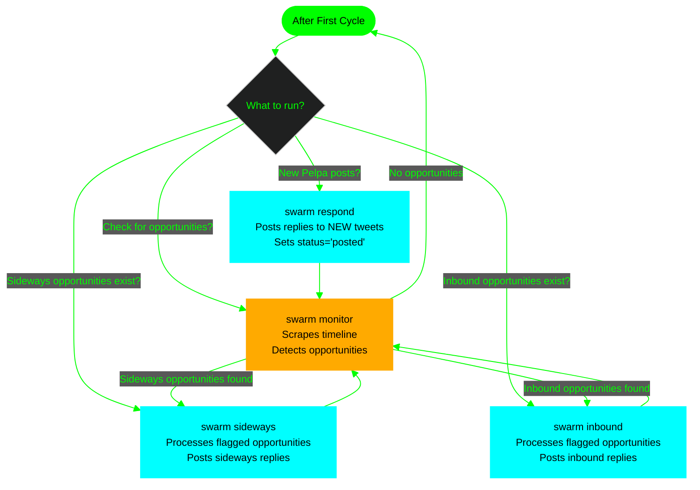

# Sideways & Inbound Reply System - Visual Workflow

Complete visual representation of the sideways and inbound reply system workflow.

---

## What Monitor Actually Does

Monitor has **TWO parts**:

### 1. Existing Behavior (Always Runs)
- Scrapes Pelpa timeline
- Stores intelligence in `raw_intelligence`
- Creates `response_queue` entries for new Pelpa tweets

### 2. NEW Detection Functions (Sideways/Inbound)
- `detectSidewaysOpportunities()` - Checks `response_queue.status='posted'` (needs respond to have run)
- `detectInboundOpportunities()` - Checks `sideways_replies` table (needs sideways to have run)

---

## Complete Execution Flow

```mermaid
%%{init: {
  "theme": "dark",
  "flowchart": { "nodeSpacing": 20, "rankSpacing": 25, "curve": "basis" },
  "themeVariables": {
    "fontSize": "12px",
    "primaryColor": "#00FF00",
    "primaryTextColor": "#000000",
    "lineColor": "#00FF00",
    "secondaryColor": "#00FFFF",
    "tertiaryColor": "#FFAA00",
    "background": "#000000",
    "mainBkgColor": "#000000",
    "textColor": "#00FF00"
  }
}}%%
flowchart TD
    subgraph RUN1["Run 1: Monitor (First Run)"]
        M1A[Scrape @pelpa333 Timeline]
        M1B[Store in raw_intelligence]
        M1C[Create response_queue entries]
        M1D[Sideways Detection<br/>Checks status='posted'<br/>Result: Nothing yet]
        M1E[Inbound Detection<br/>Checks sideways_replies<br/>Result: Nothing yet]
    end
    
    subgraph RUN2["Run 2: Respond"]
        R1[Process response_queue]
        R2[Post Amplify Replies]
        R3[Set status='posted']
    end
    
    subgraph RUN3["Run 3: Monitor (Second Run)"]
        M3A[Scrape @pelpa333 Timeline<br/>New posts]
        M3B[Store Intelligence]
        M3C[Sideways Detection<br/>Finds status='posted' tweets<br/>Flags opportunities]
        M3D[Inbound Detection<br/>Checks sideways_replies<br/>Result: Nothing yet]
    end
    
    subgraph RUN4["Run 4: Sideways"]
        S1[Process sideways_opportunities]
        S2[Post Sideways Replies]
        S3[Create sideways_replies entries]
    end
    
    subgraph RUN5["Run 5: Monitor (Third Run)"]
        M5A[Scrape @pelpa333 Timeline<br/>New posts]
        M5B[Store Intelligence]
        M5C[Sideways Detection<br/>Finds new status='posted' tweets<br/>If respond ran again]
        M5D[Inbound Detection<br/>Finds sideways_replies entries<br/>Flags inbound opportunities]
    end
    
    subgraph RUN6["Run 6: Inbound"]
        I1[Process inbound_alt_replies]
        I2[Post Inbound Replies]
        I3[Update replied=true]
    end
    
    M1A --> M1B
    M1B --> M1C
    M1C --> M1D
    M1D --> M1E
    
    M1E --> R1
    R1 --> R2
    R2 --> R3
    
    R3 --> M3A
    M3A --> M3B
    M3B --> M3C
    M3C --> M3D
    
    M3D --> S1
    S1 --> S2
    S2 --> S3
    
    S3 --> M5A
    M5A --> M5B
    M5B --> M5C
    M5C --> M5D
    
    M5D --> I1
    I1 --> I2
    I2 --> I3
    
    style M1A fill:#00FF00,stroke:#00FF00,stroke-width:2px,color:#000
    style M1D fill:#FFAA00,stroke:#FFAA00,stroke-width:1px,color:#000
    style M1E fill:#FFAA00,stroke:#FFAA00,stroke-width:1px,color:#000
    style R2 fill:#00FFFF,stroke:#00FFFF,stroke-width:1px,color:#000
    style M3C fill:#00FFFF,stroke:#00FFFF,stroke-width:1px,color:#000
    style S2 fill:#00FFFF,stroke:#00FFFF,stroke-width:1px,color:#000
    style M5D fill:#00FFFF,stroke:#00FFFF,stroke-width:1px,color:#000
    style I2 fill:#00FFFF,stroke:#00FFFF,stroke-width:1px,color:#000
```



---

## Why Monitor Runs Multiple Times

Monitor runs multiple times because it does **TWO things**:

1. **Scrapes the timeline** - Gets new Pelpa posts (always needed)
2. **Detects opportunities** - Checks what exists at that moment (depends on previous steps)

The detection functions are **additive**—they check what exists at that moment:
- If `respond` hasn't run → sideways detection finds nothing (fine)
- If `sideways` hasn't run → inbound detection finds nothing (fine)

---

## After First Cycle - What Happens Next?

After running the full cycle once, you can run commands independently:



**Key Points:**
- **Respond** - Only posts replies to NEW Pelpa tweets (if any exist)
- **Monitor** - Tells you what opportunities are available
- **Sideways** - Processes NEW sideways opportunities from latest monitor run
- **Inbound** - Processes NEW inbound opportunities from latest monitor run

You run **sideways OR inbound** depending on what opportunities exist. Monitor tells you what's available.

---

## Database Flow

```
response_queue (EXISTING)
  └─ status='posted' → Monitor checks (sideways detection)
      └─ sideways_opportunities (NEW)
          └─ processed=false → Sideways Service claims
              └─ sideways_replies (NEW)
                  └─ reply_tweet_id → Monitor checks (inbound detection)
                      └─ inbound_alt_replies (NEW)
                          └─ replied=false → Inbound Service processes
```

---

## Command Execution Summary

**First Time Setup:**
1. `swarm monitor` - Scrapes timeline, creates `response_queue` entries
2. `swarm respond` - Posts amplify replies, sets `status='posted'`
3. `swarm monitor` - Detects sideways opportunities
4. `swarm sideways` - Posts sideways replies, creates `sideways_replies` entries
5. `swarm monitor` - Detects inbound opportunities
6. `swarm inbound` - Posts inbound replies

**Ongoing Operations:**
- Run `swarm monitor` to check what's available
- Run `swarm respond` if new Pelpa tweets exist
- Run `swarm sideways` if sideways opportunities exist
- Run `swarm inbound` if inbound opportunities exist

Monitor is your **orchestrator** - it tells you what needs processing.
